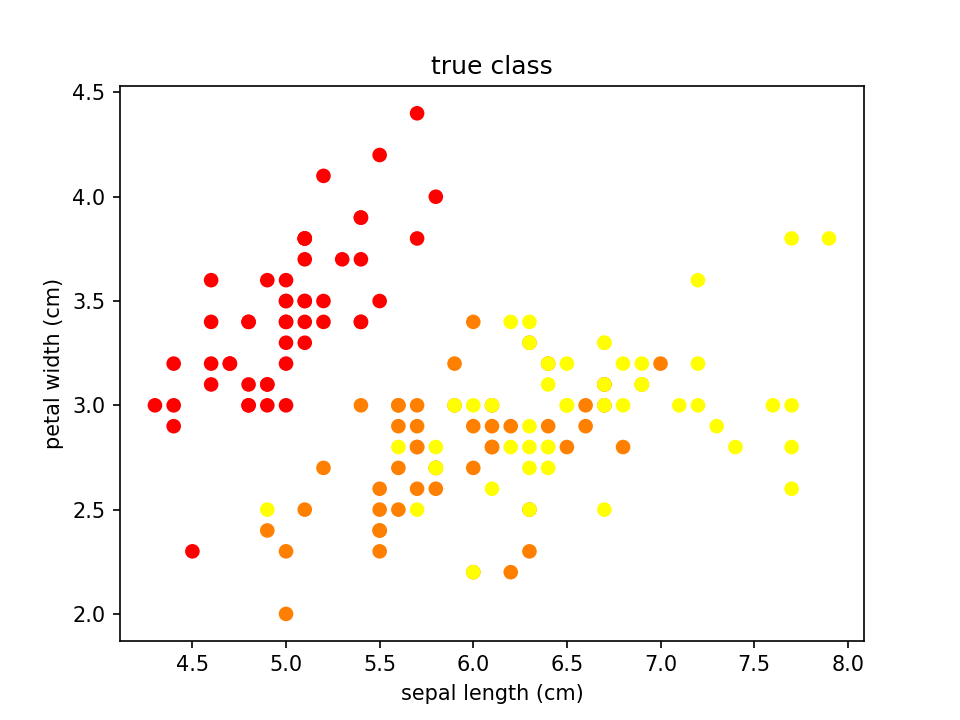
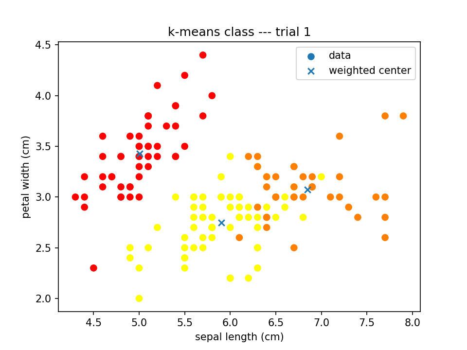

# K-means

One of the clustering methods written with Python 3

---

## Preliminary 

This program requires modules below:

- numpy
- pandas
- matplotlib
- sklearn (scikit-learn)
- joblib (if you want to parallel ***trials***)

Here, ***iris dataset*** in *scikit-learn* is used as an example

> TASK: **to make culusters of the kinds of iris** (***setosa, versicolour, virginica***) **using information** (***sepal width, sepal length***) **or** (***sepal width, sepal length, petal width, petal length***) 

## Python files

| File name             | Class         | Explanation                           |
| --                    | --            | --                                    |
| `main.py`             | (None)        | to run K-means algorithm              |
| `k_means.py`          | KMEANS        | program body                          |
| `configuration.py`    | Configuration | to set hyperparameters and dataset    |
| `logger.py`           | Logger        | to export log                         |

## Output folders and files

exported by `k_means.py` and `logger.py`

| Name                          | Folder/File   | Explanation                                           |
| --                            | --            | --                                                    |
| `trial`                       | Folder        | where result of each trial stored                     |
| `epoch.csv`                   | File          | the number of costed epochs to converge in each trial |
| `experimental_setting.txt`    | File          | log of configuration                                  |
| `true_class.pdf`              | File          | scatter graph of true class                           |
| `true_class.png`              | File          | scatter graph of true class                           |

---

The true class:

An example of results:

